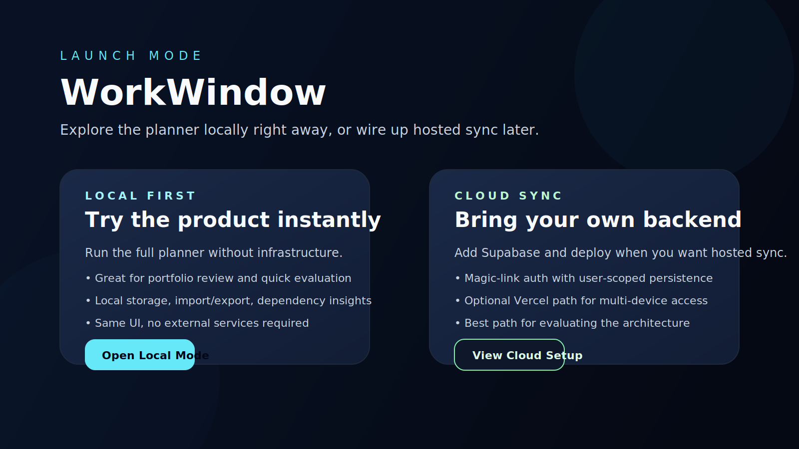
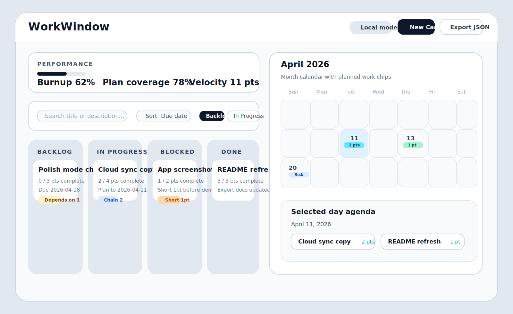

# WorkWindow

WorkWindow is a local-first planning app that unifies calendar scheduling, Kanban execution, and workload visibility in one interface.

It is designed to answer a practical productivity gap: tasks, dates, and execution status usually live in separate tools. WorkWindow brings them together with dependency and risk context so planning and delivery decisions happen in one place.




## Why This Project Matters

- Product-thinking implementation of a real planning workflow, not a demo CRUD app.
- Local-first UX with optional authenticated cloud sync.
- Dependency-aware execution model with risk visibility and progress tracking.
- Test-backed frontend architecture suitable for production iteration.

## Core Capabilities

- Kanban board with Backlog, In Progress, Blocked, and Done lanes.
- Month calendar with due-date anchors and supporting work windows.
- Dependency warnings, chain visibility, and cycle badges.
- Due-date shortfall and overdue risk indicators.
- Performance panel with burnup, plan coverage, and weekly velocity.
- JSON import/export and local/cloud mode support.
- Touch-friendly fallback actions for planning and status changes.

## Technical Snapshot

- React + Vite frontend, local-first state persistence.
- Optional Supabase Auth + Postgres sync path.
- Normalized reducer-driven state with migration scaffolding.
- Tests across store logic, calendar interactions, and Kanban flows.
- CI-gated quality checks with automated secret scanning.

## Quick Start (Local-First)

Use this path to run the app without any external services.

```bash
npm install
npm run dev
```

If no cloud env vars are present, the app opens with a mode chooser:

- `Local First` launches the full planner using browser storage only
- `Cloud Sync` shows the setup path for Supabase-backed auth and sync

## Optional Cloud Sync

For authenticated multi-device sync and hosted deployment, follow the setup guide:

- [Cloud Sync Setup](./docs/cloud-setup.md)

## Repository Boundaries

WorkWindow is maintained as a public product repository. Keep this repository focused on product code and public-safe defaults.

- Include: UI, app logic, tests, docs, schema, migration scripts, sample data.
- Exclude: personal secrets, bot tokens, private deployment credentials, personal automation scripts, exported personal task data.

If you run personal automations (for example OpenClaw + Telegram), keep that in a separate private repository and integrate through API/webhook contracts rather than embedding private credentials in this repo.

### Data and secret handling

- Store live app data in runtime storage (browser storage, Supabase, or your backend database), not in git.
- Keep only placeholders in `.env.example`.
- Keep `.env.local` untracked.
- Never expose server-only keys (such as Supabase service-role keys) in Vite environment variables.

Secret scanning runs in CI on every push and pull request to `main`.

## Trust and Policies

- Security policy: [SECURITY.md](./SECURITY.md)
- Privacy notice: [PRIVACY.md](./PRIVACY.md)

## Quality Checks

```bash
npm run test
npm run build
npm run lint
```

Preview a production build:

```bash
npm run preview
```

## Known Limitations

- tests cover core flows, but not every interaction edge case
- the calendar is month-only today
- mobile uses touch-friendly action fallbacks instead of advanced drag-and-drop
- there is no automatic scheduling suggestion engine yet

## Development Notes

Developer workflow and repository checks live in [CONTRIBUTING.md](./CONTRIBUTING.md).
