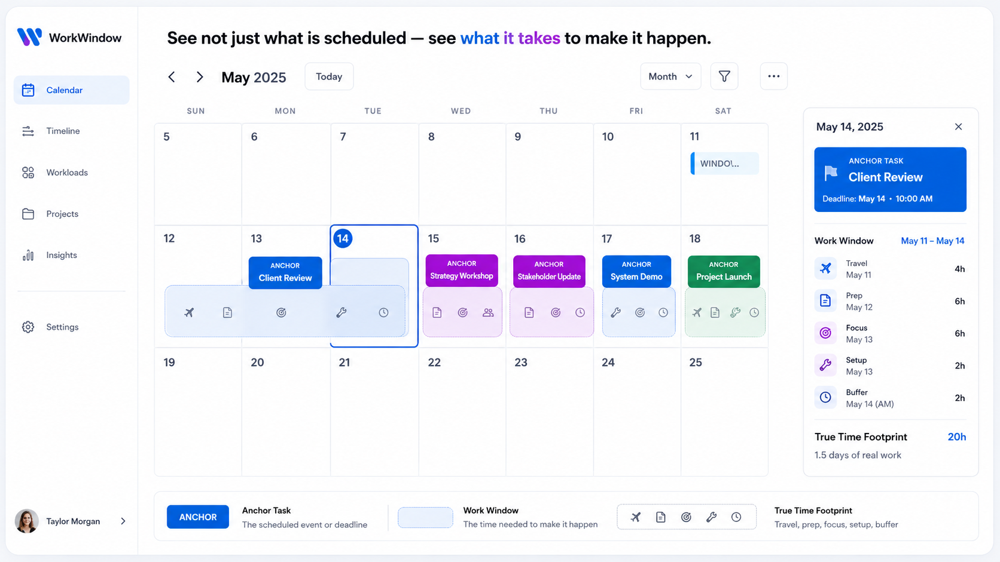
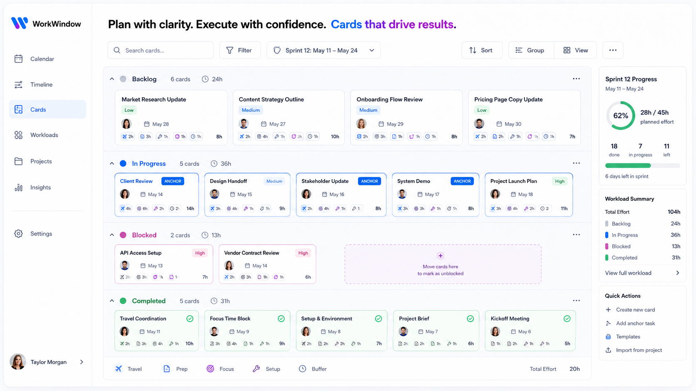

# UI Review Inbox

Use this file to collect screenshots, image links, or notes for future WorkWindow UI changes.

## Images To Review

## Extracted UI Direction

- Use a persistent left sidebar with WorkWindow branding and primary destinations: Calendar, Timeline, Cards, Workloads, Projects, Insights, Settings.
- Calendar view should lead with a product thesis headline, month controls, status filters, the month grid, a selected-day detail panel, and a legend that explains Anchor Task, Work Window, and True Time Footprint.
- Anchor tasks are saturated colored blocks tied to due dates. Work windows are lighter supporting blocks with the same accent family.
- Cards view should use grouped execution lanes by status, compact work item cards, workload totals, progress summary, and quick actions.
- Cross functionality to preserve: create/edit/delete work items, status movement, drag to calendar, add window to selected date, edit window points, progress logging, risk/dependency badges, import/export, and local/cloud modes.

### GPT UI 1



Context:

- What screen or flow this relates to:
- What feels off:
- What outcome you want:

### GPT UI 2



Context:

- What screen or flow this relates to:
- What feels off:
- What outcome you want:

Add each image as a new item:

```md
### Short Title


Context:

- What screen or flow this relates to:
- What feels off:
- What outcome you want:
```

## Open UI Notes

-
